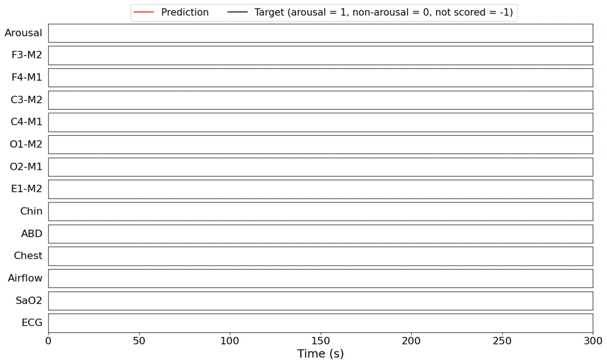
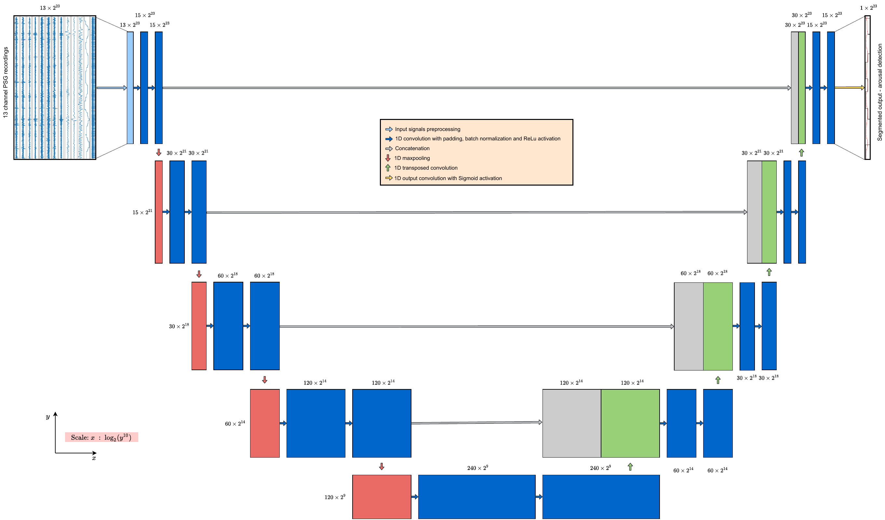
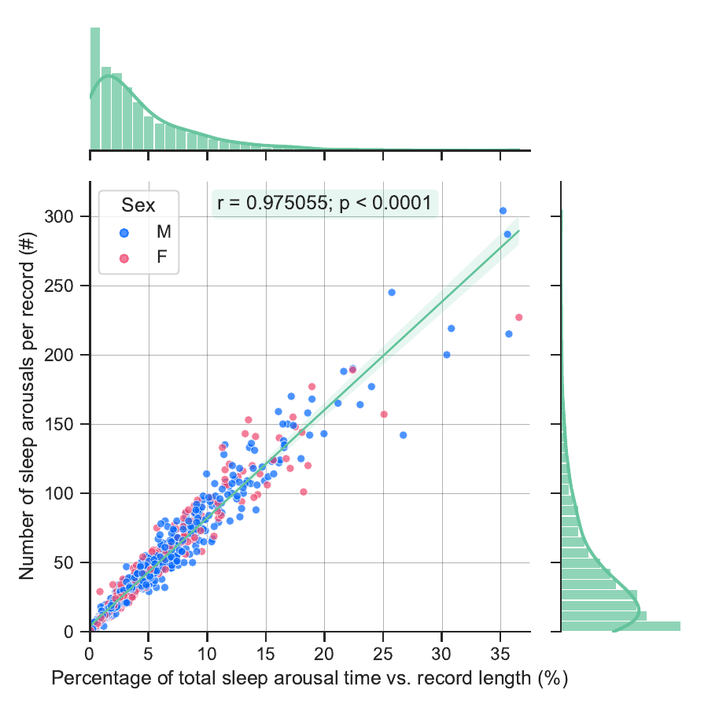
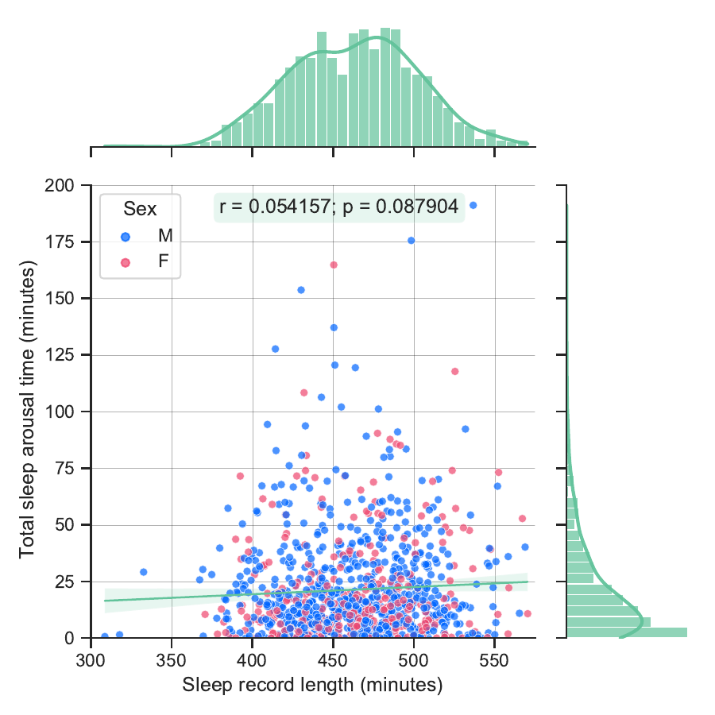
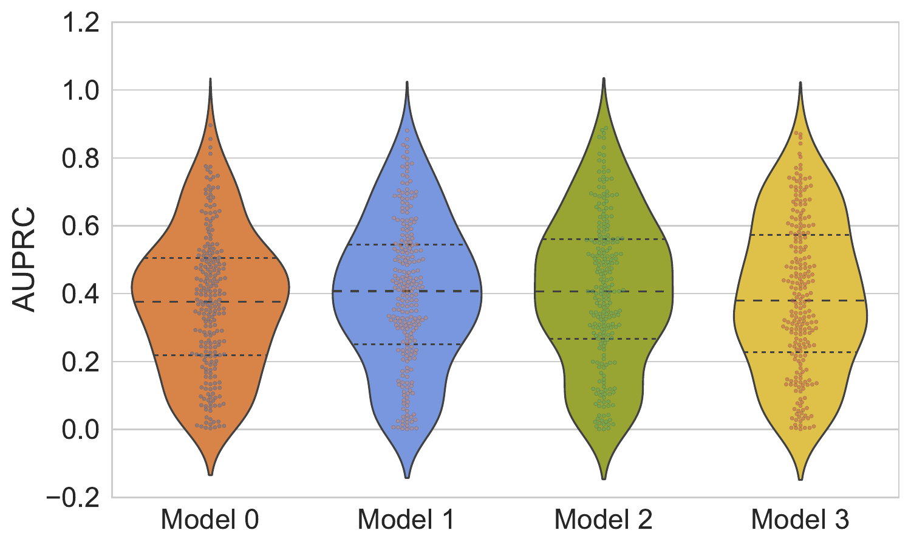
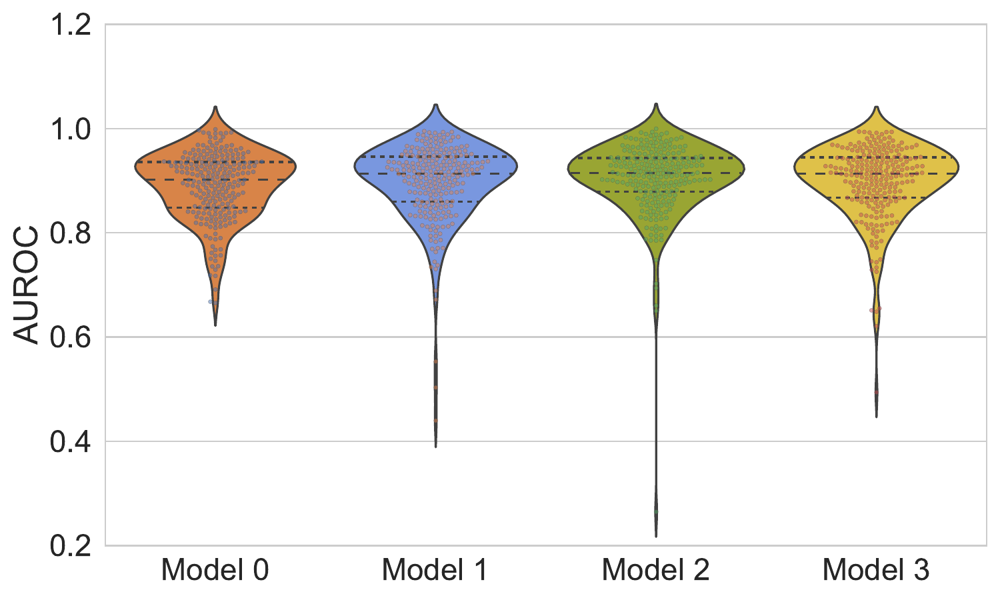
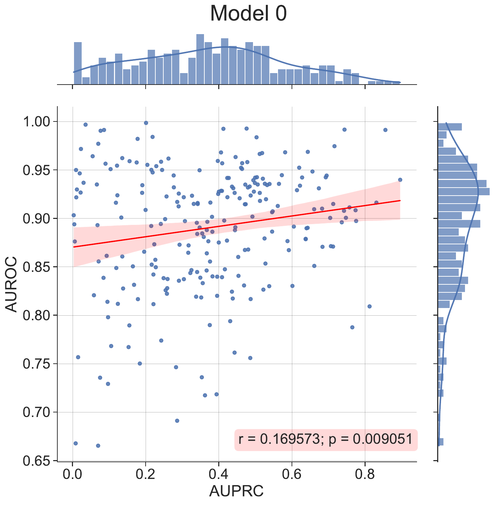
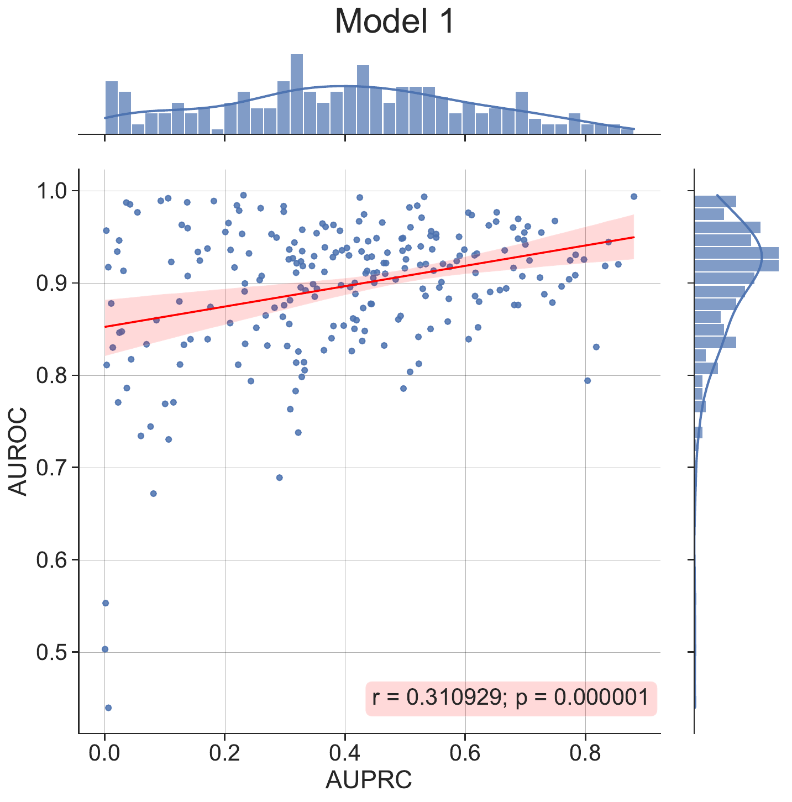
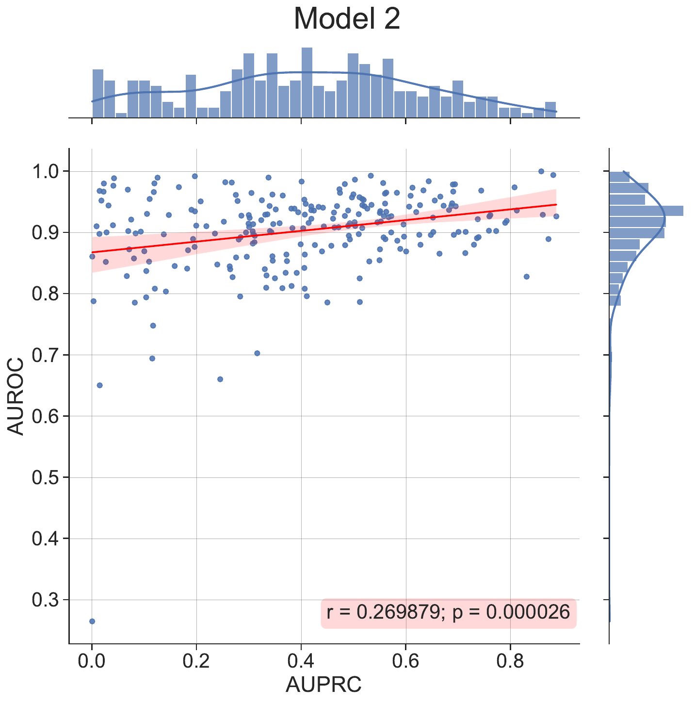
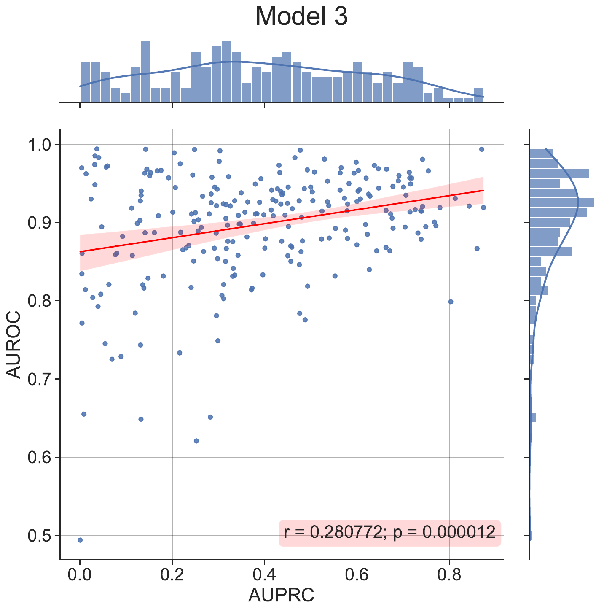

# DeepSleep 2.0

[](https://github.com/rfonod/deepsleep2/releases) [](https://github.com/rfonod/deepsleep2/blob/main/LICENSE) [](https://github.com/rfonod/deepsleep2/issues) [](https://www.python.org/) [](https://pytorch.org/) [](https://doi.org/10.3390/ai3010010) [](https://doi.org/10.5281/zenodo.13964322)

**DeepSleep 2.0** is a compact, [U-Net](https://arxiv.org/abs/1505.04597)-inspired **1D fully convolutional network** that segments non-apnea **sleep arousals** from full-length, multi-channel **polysomnographic (PSG)** recordings at native **5-millisecond resolution**. With only **740,551 trainable parameters**, it is a lightweight successor to [DeepSleep](https://www.nature.com/articles/s42003-020-01542-8), the network that achieved the highest unofficial score in the [2018 PhysioNet/CinC Challenge](https://physionet.org/content/challenge-2018/1.0.0/), reaching comparable accuracy at a fraction of the depth, memory, and compute. Full details are in the open-access paper published in *[AI](https://doi.org/10.3390/ai3010010)* (MDPI, 2022).



🎬 A 300-second window of a 13-channel PSG recording with the model's predicted arousal probability (red) overlaid on the ground-truth labels (black).

> [!NOTE]
> Running the code requires the ~135 GB PhysioNet/CinC 2018 Challenge dataset. See [`data/README.md`](data/README.md) for download instructions. The repository ships with pretrained model checkpoints, so you can inspect results without the raw data.

## Overview

Sleep arousals are brief intrusions of wakefulness that fragment sleep. Detecting them from PSG is laborious to do by hand and highly imbalanced (arousals are sparse). DeepSleep 2.0 casts this as a **dense, per-sample segmentation** problem: it consumes an entire night of raw multi-channel signal and outputs an arousal probability for every 5 ms time step in a single forward pass, with no windowing or patching at inference.

### Key Features

- 🪶 **Compact**: a 5-level encoder/decoder with just **740,551** parameters (vs. 11 levels in the original DeepSleep).
- 🌊 **Full-length input**: processes complete raw PSG recordings end-to-end, padded and centered to 2²³ (8,388,608) samples.
- ⏱️ **Native 5 ms resolution**: one prediction per input sample at 200 Hz, no post-hoc upsampling.
- 🎚️ **Aggressive multi-scale pooling**: downsampling factors of 4, 8, 16, 32 keep the network shallow yet wide in receptive field.
- 🎭 **Masked BCE loss**: unscored regions (label `-1`) are excluded from the objective.
- 📊 **AUPRC-first evaluation**: the primary metric for this heavily imbalanced task, scored with the official PhysioNet [`score2018.py`](score2018.py).
- 🧪 **Signal-space augmentations**: magnitude scaling, related-channel shuffling, and Gaussian channel injection, applied on-the-fly during training.

## Architecture



🔍 The DeepSleep 2.0 architecture: a 1D U-Net with a five-level encoder/decoder and skip connections.

The network ([`architectures/architecture_v1.py`](architectures/architecture_v1.py)) is a 1D adaptation of the classic 2D U-Net:

- **Building block (`DoubleConv`)**: two `Conv1d` layers (kernel size 7, padding 3, no bias), each followed by `BatchNorm1d` and `ReLU`.
- **Encoder**: an input conv (13 → 15 channels) followed by four `Down` blocks (`MaxPool1d` → `DoubleConv`) that progressively widen the representation (15 → 30 → 60 → 120 → 240) while pooling by 4, 8, 16, and 32.
- **Decoder**: four symmetric `Up` blocks that upsample (linear interpolation by default, or transposed convolution), concatenate the corresponding encoder skip connection, and apply a `DoubleConv`.
- **Output head (`OutConv`)**: a 1×1 `Conv1d` to a single channel; a `Sigmoid` is applied only at scoring time (training uses raw logits with a numerically stable BCE-with-logits loss).
- **Initialization**: Xavier-uniform on all convolutional weights with ReLU gain.

Compared to the original DeepSleep (depth 11, 480-channel bottleneck), DeepSleep 2.0 halves the depth and quarters the bottleneck width, trading a modest accuracy drop for a much lighter, faster model.

## Dataset

The model is trained and evaluated on the [PhysioNet/CinC 2018 Challenge](https://physionet.org/content/challenge-2018/1.0.0/) *"You Snooze You Win"* dataset: **994** annotated training recordings and **989** hidden-test recordings, each roughly 7 to 8 hours long, sampled at **200 Hz**. Each recording provides **13 physiological channels**:

| # | Channel | Modality |
|---|---------|----------|
| 0–5 | F3-M2, F4-M1, C3-M2, C4-M1, O1-M2, O2-M1 | EEG (electroencephalography) |
| 6 | E1-M2 | EOG (electrooculography) |
| 7 | Chin | EMG (chin) |
| 8–9 | ABD, Chest | Respiratory effort (abdomen, chest) |
| 10 | Airflow | Respiration |
| 11 | SaO₂ | Oxygen saturation |
| 12 | ECG | Single-lead electrocardiogram |

Per-sample labels are **1** (arousal), **0** (non-arousal), or **−1** (unscored, masked from the loss). Preprocessing ([`utils.py`](utils.py)) zero-pads and centers every recording to 2²³ samples, optionally applies per-channel Z-score normalization, and caches the result as `.h5py` for fast reloading.

<p align="center">
  
  
</p>

<p align="center"><em>Left: the sparse, heterogeneous distribution of arousals across recordings. Right: arousal metrics vs. sleep duration.</em></p>

## Results

Evaluated on a held-out test set of **249 recordings**, using the official PhysioNet gross **AUPRC** (area under the precision-recall curve) and gross **AUROC**. For this highly imbalanced task, **AUPRC is the headline metric**.

| Model | Z-norm | Augmentations | Gross AUPRC | Gross AUROC | Test BCE loss |
|-------|:------:|---------------|:-----------:|:-----------:|:-------------:|
| `model_0` | ✗ | MagScale | 0.3879 | 0.8789 | 0.1770 |
| `model_1` | ✓ | MagScale | 0.4437 | 0.8944 | 0.1666 |
| **`model_2`** ⭐ | ✓ | MagScale + RandShuffle | **0.4504** | **0.9012** | **0.1643** |
| `model_3` | ✓ | MagScale + RandShuffle + Gaussian | 0.4071 | 0.8951 | 0.1700 |
| *DeepSleep (reference, ensemble)* | n/a | n/a | *0.550* | *0.927* | *n/a* |

The best configuration (`model_2`) reaches **0.4504 AUPRC / 0.9012 AUROC**, close to the far larger original DeepSleep ensemble, while remaining compact. Z-score normalization and related-channel shuffling both help; the novel Gaussian channel-injection augmentation did not improve over channel-shuffling alone.

<p align="center">
  
  
</p>

<p align="center"><em>Distributions of per-record AUPRC (left) and AUROC (right) across the 249 test recordings.</em></p>

<details>
<summary><b>📈 Per-model AUPRC-vs-AUROC correlation (all four configs)</b></summary>

<p align="center">
  
  
  <br>
  
  
</p>

<p align="center"><em>Subject-wise AUPRC vs. AUROC for <code>model_0</code> to <code>model_3</code> (top-left to bottom-right).</em></p>

</details>

## Pretrained Models

Four trained configurations ship under [`models/`](models). Each folder contains the `hyperparameters.txt` config, per-epoch `my_checkpoint_<n>.pth.tar` checkpoints, the `records.csv` test split, and cached `test_loss_*` / `test_score_*` pickles.

| Config | Z-norm | Augmentations | Best epoch | AUPRC | AUROC |
|--------|:------:|---------------|:----------:|:-----:|:-----:|
| [`model_0`](models/model_0) | ✗ | MagScale | 20 | 0.3879 | 0.8789 |
| [`model_1`](models/model_1) | ✓ | MagScale | 12 | 0.4437 | 0.8944 |
| [`model_2`](models/model_2) ⭐ | ✓ | MagScale + RandShuffle | 21 | 0.4504 | 0.9012 |
| [`model_3`](models/model_3) | ✓ | MagScale + RandShuffle + Gaussian | 18 | 0.4071 | 0.8951 |

All configs share the same recipe: Adam (lr = 1e-4, weight decay = 1e-5), batch size 2, up to 50 epochs with early stopping (patience 7), seed 1, and mixed-precision training. The "best epoch" is the checkpoint with the lowest validation loss.

## Installation

```bash
git clone https://github.com/rfonod/deepsleep2.git
cd deepsleep2

python -m venv .venv && source .venv/bin/activate   # or use conda
pip install -r requirements.txt
```

A CUDA-capable GPU is strongly recommended for training (inference also runs on CPU). Install a [CUDA-enabled PyTorch build](https://pytorch.org/get-started/locally/) to use the GPU.

<details>
<summary><b>🕰️ Reproduce the exact paper environment</b></summary>

The published results were produced with Python 3.8 and PyTorch 1.9. To recreate that environment bit-for-bit:

```bash
pip install -r requirements-legacy.txt
```

The notebook is backward-compatible: an AMP compatibility shim automatically uses the modern `torch.amp` API on PyTorch ≥ 2.4 and falls back to `torch.cuda.amp` on older installs, so the same code runs on both stacks.

</details>

## Usage

Everything runs through the [`deep_sleep2.ipynb`](deep_sleep2.ipynb) notebook. Open it and set the **Main Switches** at the top:

```python
MODEL_NAME     = 'model_2'   # which config under ./models to use: model_0 .. model_3
TRAIN_MODE     = True        # True = train; False = inference / evaluation only
LOAD_CHECKPOINT = False      # resume from the latest checkpoint in the model folder
```

Then run the cells top-to-bottom. The notebook will:

1. Build `RECORDS.txt` manifests and preprocess/cache the PSG signals to `.h5py`.
2. Split the data (60% train / 15% val / 25% test when only the training folder is present).
3. Train with on-the-fly augmentations, or load a checkpoint for evaluation.
4. Identify the best (lowest validation loss) checkpoint and report gross AUPRC / AUROC on the test set using the official scorer.

To **evaluate a pretrained model without training**, set `TRAIN_MODE = False`; the notebook loads the shipped checkpoints and reproduces the results table above.

## Repository Structure

```text
deepsleep2/
├── deep_sleep2.ipynb          # main notebook: preprocessing, training, evaluation
├── architectures/
│   └── architecture_v1.py     # DeepSleepNet, the 1D U-Net
├── losses.py                  # masked BCE / BCE-with-logits losses
├── utils.py                   # PSG I/O, padding, Z-normalization, .h5py caching
├── score2018.py               # official PhysioNet 2018 AUPRC/AUROC scorer
├── models/                    # 4 pretrained configs + checkpoints + results
├── data/                      # dataset download scripts (data itself not shipped)
├── assets/                    # figures used in this README and the paper
├── requirements.txt           # modern dependencies (Python 3.8+, PyTorch 2+)
└── requirements-legacy.txt    # exact frozen paper environment (PyTorch 1.9)
```

## Citation

If you use DeepSleep 2.0 in your research, please cite the paper:

```bibtex
@Article{Fon22a,
  author    = {Fonod, Robert},
  title     = {{DeepSleep 2.0: Automated Sleep Arousal Segmentation via Deep Learning}},
  journal   = {AI},
  year      = {2022},
  volume    = {3},
  number    = {1},
  pages     = {164-179},
  doi       = {10.3390/ai3010010},
  publisher = {MDPI},
}
```

Please also consider citing the original [**DeepSleep**](https://www.nature.com/articles/s42003-020-01542-8) paper.

## Acknowledgements

- The [PhysioNet/CinC 2018 Challenge](https://physionet.org/content/challenge-2018/1.0.0/) organizers for the *You Snooze You Win* dataset and the official [`score2018.py`](score2018.py) scoring script.
- The authors of the original [DeepSleep](https://www.nature.com/articles/s42003-020-01542-8) architecture, on which this compact model is based.

## Contributing

Contributions are welcome. Please open a [GitHub Issue](https://github.com/rfonod/deepsleep2/issues) or submit a pull request.

## License

This project is distributed under the MIT License. See the [LICENSE](LICENSE) file for details.
